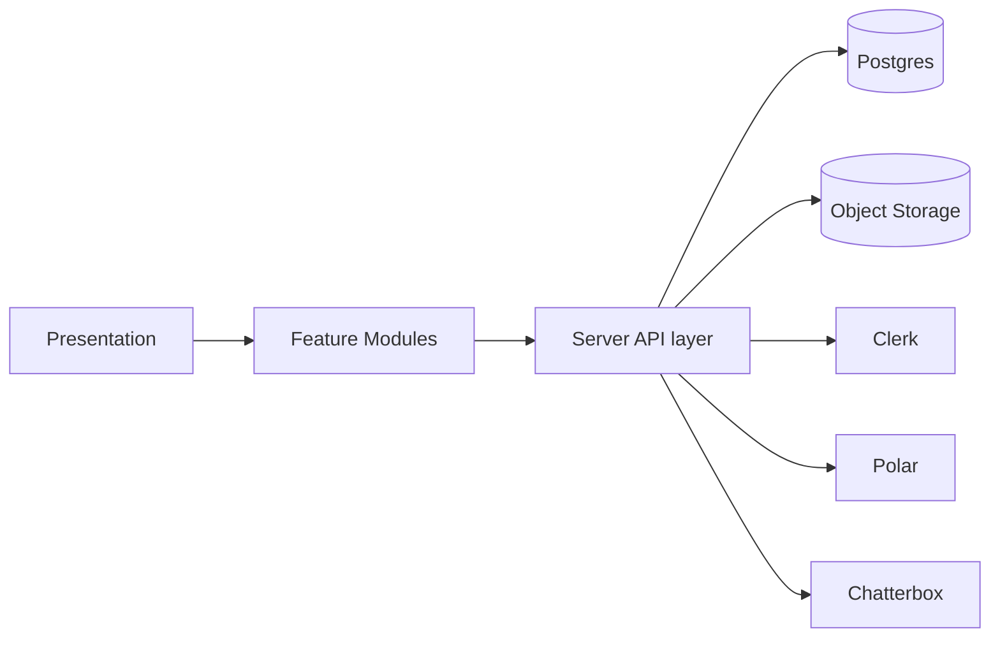
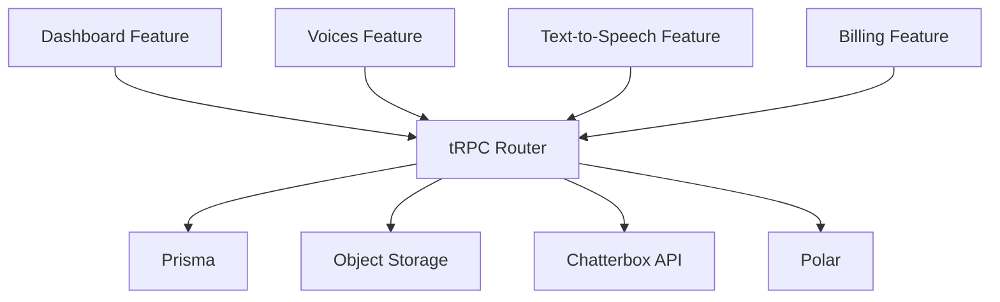

# Architecture Guide

## Table of Contents

- [Overview](#overview)
- [High-Level Architecture](#high-level-architecture)
- [Major Modules](#major-modules)
- [Module Communication](#module-communication)
- [Dependency Graph](#dependency-graph)
- [Architectural Decisions](#architectural-decisions)
- [Scalability Considerations](#scalability-considerations)
- [Security Considerations](#security-considerations)

## Overview

Resonance uses a modern app-router architecture with a clear separation between presentation, feature logic, and server-side integrations. The main reason for the current layout is to keep each product capability isolated while still allowing shared infrastructure such as authentication, billing, and storage to be reused across features.

## High-Level Architecture

The application is composed of four layers:

1. Presentation layer — React components and Next.js pages
2. Application layer — feature modules containing UI, forms, hooks, and domain-specific logic
3. Server API layer — tRPC routers and Next.js route handlers
4. Infrastructure layer — Prisma, Postgres, object storage, Clerk, Polar, and the Chatterbox API

## Major Modules

### App Router

The App Router hosts the route structure under [src/app](src/app). It is responsible for page layouts, route handlers, and the top-level provider composition.

### Feature Modules

The feature folders under [src/features](src/features) contain feature-specific UI, state, hooks, and data. This is where the product experience is implemented.

### tRPC Layer

The tRPC layer under [src/trpc](src/trpc) creates the typed application API used by the frontend. It centralizes auth and org-scoping rules.

### Integration Layer

The integration layer under [src/lib](src/lib) contains direct connections to Prisma, object storage, billing, and the Chatterbox API.

## Module Communication

The app favors a typed, request-driven architecture:

- UI components call tRPC procedures or fetch route handlers
- server procedures validate and authorize the request
- the server reads or writes to the database or storage layer
- responses are hydrated back into the UI through React Query

The most important dependency direction is inward: the UI depends on the application layer, which depends on server-side integrations.

## Dependency Graph

## Architectural Decisions

### Feature-first structure

The codebase is organized by product capability rather than by technical layer. That makes it easier to understand and evolve the product experience without scattering logic across the repository.

### Metadata in Postgres, assets in object storage

Audio content is too large and too media-specific to treat as ordinary relational data. Storing metadata in Postgres and assets in object storage keeps the database smaller and avoids coupling the relational model to large binary files.

### Typed API boundary

tRPC provides end-to-end type safety for the product’s main application APIs. It reduces drift between client and server contracts.

### Organization-scoped access

The app assumes multi-tenant usage from the beginning. Clerk organizations and the org-scoped tRPC procedures ensure that user access is tied to an organization context.

## Scalability Considerations

The current architecture is appropriate for a product that needs moderate growth in concurrent users and media assets.

Possible considerations:

- move generation and file handling to background workers if generation volume increases
- add caching for frequently requested voice metadata and signed URLs
- split audio retrieval endpoints behind a CDN or edge layer if traffic grows
- add observability and metrics around generation latency and storage failures

## Security Considerations

- Clerk handles authentication and route protection
- org-scoped procedures prevent cross-tenant data access
- input validation is enforced with Zod before storage or external API calls
- sensitive credentials are expected to be supplied through environment variables
- custom audio uploads are size-limited and validated before being persisted
