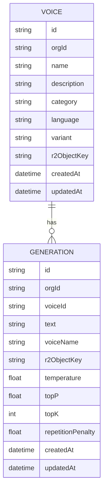

# Database Guide

## Table of Contents

- [Overview](#overview)
- [Schema](#schema)
- [Entity Relationship Diagram](#entity-relationship-diagram)
- [Tables](#tables)
- [Relationships](#relationships)
- [Indexes and Constraints](#indexes-and-constraints)
- [Migration Strategy](#migration-strategy)

## Overview

The relational database layer is currently small and focused on voice and generation metadata. Audio assets are stored separately in object storage, so the database holds references to those assets instead of the binary data itself.

## Schema

The Prisma schema is defined in [prisma/schema.prisma](prisma/schema.prisma).

## Entity Relationship Diagram



## Tables

### Voice

Represents either a built-in system voice or a custom voice created by an organization.

Fields:

- id — primary key
- orgId — organization owner for custom voices; null for system voices
- name — display name
- description — optional descriptive text
- category — voice category enum
- language — locale string
- variant — SYSTEM or CUSTOM
- r2ObjectKey — reference to audio asset in object storage
- createdAt / updatedAt — timestamps

### Generation

Represents a single text-to-speech generation request and its resulting artifact.

Fields:

- id — primary key
- orgId — owning organization
- voiceId — optional reference to the voice used
- voiceName — denormalized snapshot of the voice name
- text — prompt text used for generation
- r2ObjectKey — storage reference for the generated audio
- temperature / topP / topK / repetitionPenalty — generation parameters
- createdAt / updatedAt — timestamps

## Relationships

- One Voice can have many Generations.
- Each Generation optionally points to a Voice.
- Custom voices are scoped to an organization, while system voices are shared globally.

## Indexes and Constraints

The current schema defines indexes for:

- Voice.variant
- Voice.orgId
- Generation.orgId
- Generation.voiceId

Primary keys are generated using CUID values by Prisma.

## Migration Strategy

Migrations are stored in [prisma/migrations](prisma/migrations). The project uses Prisma’s migration flow and the migration command is expected to be run from the repository root.

Typical flow:

```bash
npx prisma migrate dev
```

If the database schema changes, the new migration should be committed along with the related application code changes.
