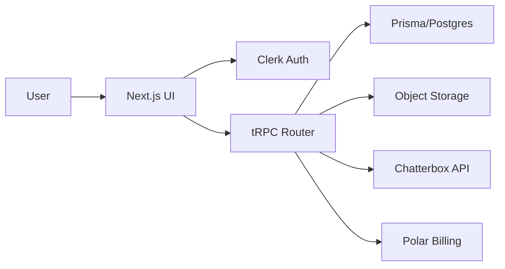

# Resonance

Resonance is a Next.js application for AI-powered text-to-speech generation, voice browsing, and custom voice creation. The product combines a Clerk-based multi-tenant auth layer, a Prisma/Postgres data model, tRPC for typed API access, and object storage for audio assets.

## Table of Contents

- [Overview](#overview)
- [Features](#features)
- [Tech Stack](#tech-stack)
- [Architecture Overview](#architecture-overview)
- [Project Structure](#project-structure)
- [Installation](#installation)
- [Environment Variables](#environment-variables)
- [Running Locally](#running-locally)
- [Build and Deployment](#build-and-deployment)
- [Available Scripts](#available-scripts)
- [API Overview](#api-overview)
- [Database](#database)
- [Authentication Flow](#authentication-flow)
- [External Services](#external-services)
- [Screenshots](#screenshots)
- [Future Improvements](#future-improvements)
- [Contributing](#contributing)
- [License](#license)
- [Credits](#credits)

## Overview

This repository contains the web app shell for Resonance, including:

- a dashboard for starting new audio generation requests
- a text-to-speech experience with voice selection, generation settings, and generation history
- a voice library for browsing built-in and custom voices
- a custom voice upload flow that stores audio in an object storage bucket and persists metadata in Postgres
- subscription and billing integration through Polar

## Features

- Authenticated organization-based access with Clerk
- Dashboard entry points for text-to-speech and voice management
- Voice browsing for built-in and custom voices
- Custom voice creation via upload or recording
- Audio generation requests routed to an external Chatterbox API
- Audio playback and generation history
- Subscription gating for custom voice creation
- Billing checkout and customer portal links through Polar

## Tech Stack

- Next.js 16 (App Router)
- React 19
- TypeScript
- Tailwind CSS
- tRPC + TanStack Query
- Prisma ORM with PostgreSQL
- Clerk for authentication and organization selection
- Polar for billing and subscriptions
- AWS S3-compatible object storage via the AWS SDK
- Zod for input validation
- shadcn-style UI primitives

## Architecture Overview

The app is organized as a feature-driven Next.js application:

- the App Router handles page-level routing and layout composition
- Clerk middleware protects routes and enforces organization selection
- client pages use tRPC and React Query to fetch data from the server
- server-side routers interact with Prisma, the Chatterbox API, and object storage
- audio assets are stored outside Postgres in an object store and referenced by signed URLs



## Project Structure

```text
.
├── prisma/                 # Prisma schema and migrations
├── public/                 # Static assets
├── scripts/                # Seed and sync utilities
├── src/
│   ├── app/                # App Router pages, layouts, and API routes
│   ├── components/         # Shared UI primitives and presentational components
│   ├── features/           # Feature modules such as dashboard, text-to-speech, voices, billing
│   ├── hooks/              # Shared hooks
│   ├── lib/                # Shared server/client utilities and integrations
│   ├── trpc/               # tRPC router, client, and server wiring
│   └── generated/          # Prisma-generated client output
├── package.json            # Scripts and dependencies
└── WORKFLOW.md             # Developer-oriented workflow guide
```

## Installation

### Prerequisites

- Node.js 20+
- npm
- PostgreSQL database
- Access to an AWS S3-compatible object storage bucket
- Clerk account and application keys
- Polar account and product configuration
- Chatterbox API credentials

### Steps

1. Clone the repository.
2. Install dependencies:
   ```bash
   npm install
   ```
3. Create a local environment file based on the variables below.
4. Run Prisma generation and migrations:
   ```bash
   npx prisma generate
   npx prisma migrate dev
   ```
5. Seed system voices if the storage bucket and database are ready:
   ```bash
   npx prisma db seed
   ```

## Environment Variables

The runtime config is defined in [src/lib/env.ts](src/lib/env.ts). A starter template is available in [.env.example](.env.example).

| Variable | Required | Purpose |
| --- | --- | --- |
| DATABASE_URL | Yes | PostgreSQL connection string |
| APP_URL | Yes | Application base URL used by billing callbacks |
| POLAR_ACCESS_TOKEN | Yes | Polar API access token |
| POLAR_SERVER | Yes | Polar server mode: sandbox or production |
| POLAR_PRODUCT_ID | Yes | Polar product identifier |
| AWS_REGION | Yes | Object storage region |
| AWS_ACCESS_KEY_ID | Yes | Object storage access key |
| AWS_SECRET_ACCESS_KEY | Yes | Object storage secret key |
| S3_BUCKET_NAME | Yes | Bucket used for voice and generation audio |
| CHATTERBOX_API_URL | Yes | Chatterbox API base URL |
| CHATTERBOX_API_KEY | Yes | Chatterbox API credential |
| NEXT_PUBLIC_CLERK_PUBLISHABLE_KEY | Needs verification | Clerk client key |
| CLERK_SECRET_KEY | Needs verification | Clerk server key |

## Running Locally

```bash
npm run dev
```

Then open http://localhost:3000.

## Build and Deployment

### Build

```bash
npm run build
```

### Start the production build

```bash
npm start
```

### Deployment notes

The repository currently contains a standard Next.js build setup and no custom deployment pipeline files were found. The app is suitable for deployment on Vercel or another Node.js host that can provide the required environment variables and Postgres access.

## Available Scripts

- npm run dev — start the development server
- npm run build — create a production build
- npm run start — run the built app
- npm run lint — run ESLint
- npm run sync-api — run the API sync helper script
- postinstall — runs Prisma client generation

## API Overview

The app exposes two styles of server endpoints:

- Next.js route handlers under [src/app/api](src/app/api) for file-serving and voice creation
- tRPC routers under [src/trpc](src/trpc) for typed application APIs

The most important flows are:

- voice listing and deletion
- generation creation and history lookup
- billing checkout and portal session creation
- audio delivery through signed URLs

See [API.md](API.md) for endpoint-level documentation.

## Database

The database is a PostgreSQL instance managed through Prisma. The current schema stores organizations, voices, and generations. See [DATABASE.md](DATABASE.md) for schema details.

## Authentication Flow

1. The user reaches a protected route.
2. Clerk middleware checks authentication state.
3. If no user is signed in, the request is redirected to a Clerk sign-in page.
4. If the user is signed in but no organization is selected, the app redirects to the organization selection page.
5. Protected API and tRPC routes require both a user and an organization context.

## External Services

- Clerk — authentication and organization membership
- Polar — billing, checkout, and customer portal
- AWS S3-compatible storage — audio persistence and signed downloads
- Chatterbox API — speech synthesis generation

## Screenshots

No screenshots are currently included in the repository. Placeholder sections can be added here when product UI captures are available.

## Future Improvements

- add automated tests and CI
- add structured logging and observability
- add background jobs for audio cleanup and processing retries
- expand billing and quota enforcement
- add richer analytics and usage reporting

## Contributing

Please read [CONTRIBUTING.md](CONTRIBUTING.md) before opening a pull request. Keep changes focused, use existing feature folders, and prefer small, reviewable updates.

## License

No license file is currently present in the repository. The project should be licensed explicitly before public release.

## Credits

This project uses the following libraries and platforms:

- Next.js
- Prisma
- tRPC
- Clerk
- Polar
- AWS SDK
- Chatterbox API
- shadcn-style UI components
