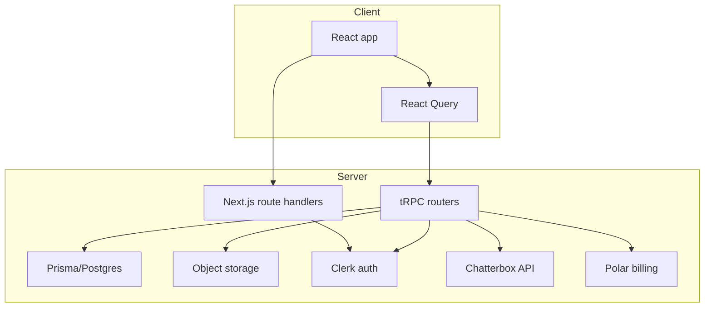
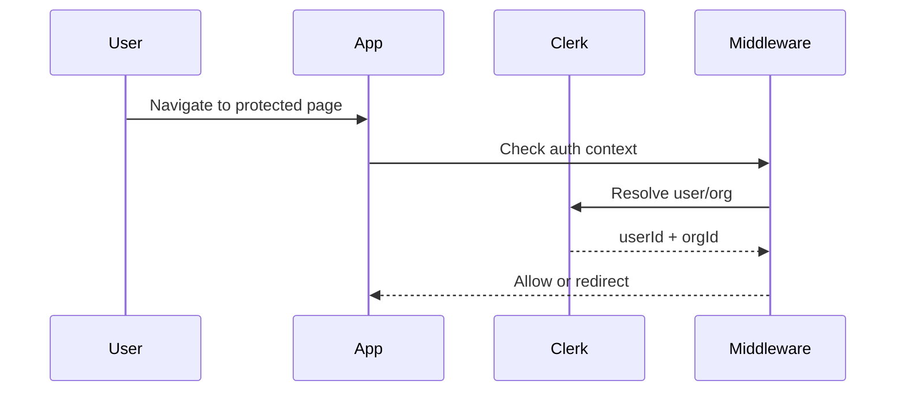
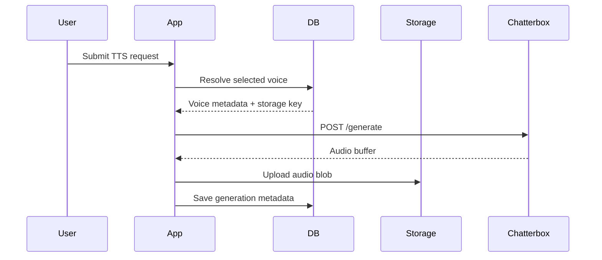
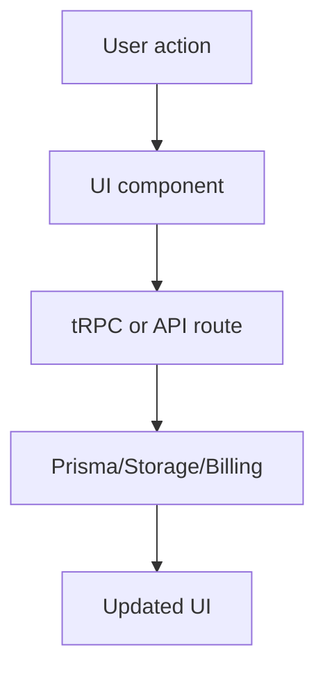
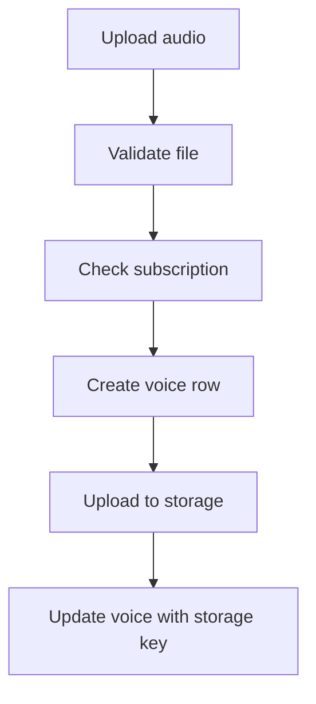

# Workflow Guide

## Table of Contents

- [Purpose](#purpose)
- [System Architecture](#system-architecture)
- [Request Lifecycle](#request-lifecycle)
- [Data Flow](#data-flow)
- [User Flow](#user-flow)
- [Authentication and Authorization](#authentication-and-authorization)
- [Database Workflow](#database-workflow)
- [API Workflow](#api-workflow)
- [Frontend to Backend Communication](#frontend-to-backend-communication)
- [State Management](#state-management)
- [Voice Upload Workflow](#voice-upload-workflow)
- [Billing Workflow](#billing-workflow)
- [AI Workflow](#ai-workflow)
- [Error Handling](#error-handling)
- [Logging and Observability](#logging-and-observability)
- [Folder Responsibilities](#folder-responsibilities)
- [Design Patterns](#design-patterns)
- [Important Business Logic](#important-business-logic)
- [Mermaid Diagrams](#mermaid-diagrams)
- [Tips for New Contributors](#tips-for-new-contributors)

## Purpose

This document explains how Resonance works from a developer perspective. It is meant to help a new contributor understand why the current architecture looks the way it does and how requests move through the application.

## System Architecture

Resonance is a feature-oriented Next.js app with a thin server layer around Prisma, Clerk, tRPC, and object storage. The product is built around two core experiences:

- generate speech from text using a selected voice
- create and manage custom voices from uploaded audio

The app uses Clerk to manage users and organization membership, and it uses tRPC to keep the UI and server contract typed. The database stores only metadata, while audio assets are persisted in object storage and served through signed URLs.

## Request Lifecycle

A request generally follows this path:

1. The browser enters a Next.js route.
2. Clerk middleware checks whether the user is authenticated and whether an organization is selected.
3. The route or tRPC procedure runs.
4. The procedure validates input using Zod.
5. The server reads from Postgres or writes to storage.
6. For generation jobs, the server calls the Chatterbox API and stores the resulting audio asset.
7. The UI updates from the returned data or from invalidation signals.

## Data Flow

The main data flow is split into three categories:

- metadata flow: Prisma stores voice and generation metadata
- asset flow: audio files go to the object store and are retrieved via signed URLs
- billing flow: Polar stores subscription and billing state outside the app

The app keeps a denormalized snapshot of voice identity on each generation record so the generation detail page can still show the voice name even if the voice record is later edited or deleted.

## User Flow

A typical user journey is:

1. Sign in through Clerk.
2. Choose or create an organization.
3. Open the dashboard.
4. Enter text and choose a voice.
5. Submit the generation request.
6. View the generation result and history.
7. Optionally create a custom voice from an uploaded sample.

## Authentication and Authorization

Authentication is delegated to Clerk. The middleware in [src/proxy.ts](src/proxy.ts) protects non-public routes and redirects unauthenticated users to sign-in.

Authorization is organization-scoped. The app uses the Clerk organization context and only allows access to data that belongs to the current organization. The tRPC helper [src/trpc/init.ts](src/trpc/init.ts) enforces both user and org presence.

## Database Workflow

The Prisma schema currently includes two primary models:

- Voice
- Generation

A voice may have many generations. Each generation references a voice optionally, and the application persists the voice name snapshot at generation time. Audio storage keys are kept in the database but the binary audio lives in object storage.

This design keeps the database lightweight and makes it easier to serve large audio blobs separately from relational metadata.

## API Workflow

The app uses two API layers:

- Next.js route handlers for file and upload requests
- tRPC routers for the app’s internal typed API

Requests are authenticated through Clerk and then authorized by the current organization context. When a custom voice is created, the server validates the uploaded audio file and stores it in object storage before persisting the voice record.

## Frontend to Backend Communication

The React UI uses TanStack Query and tRPC for data access. Server components prefetch some queries and hydrate them with the server render. Client components then consume the hydrated data and trigger mutations for create/update/delete actions.

The main communication pattern is:

- query for lists or detail records
- mutation for create/delete and generation actions
- invalidation to refresh related UI state after mutations

## State Management

Most UI state is local to components, with the main shared state living in context for the text-to-speech experience. The app uses React Query for server state and local React state for mostly ephemeral interactions such as forms, dialogs, and audio playback state.

## Voice Upload Workflow

1. The user uploads or records an audio sample.
2. The client sends the file to the voice creation route.
3. The server validates that the file exists, is under the size limit, and appears to be a valid audio file.
4. The server checks whether the organization has an active subscription.
5. If allowed, the server creates a voice record, uploads the audio to object storage, and links the stored key back to the database row.
6. The UI invalidates the voice list so the new voice appears immediately.

## Billing Workflow

Billing is currently handled through Polar:

- checkout sessions are created from the billing router
- customer portal sessions are created for subscription management
- the status query checks whether the current organization has an active subscription

The app gates custom voice creation behind this billing state.

## AI Workflow

The AI workflow is centered around speech generation:

- the UI collects text, voice selection, and generation parameters
- the server resolves the selected voice and validates that it has an object storage asset
- the server sends the prompt and voice key to the external Chatterbox API
- the returned audio buffer is uploaded to object storage
- the generation record is persisted with the returned object key

## Error Handling

The app uses route-level and mutation-level error handling. The most common behavior is:

- return structured errors for invalid input or missing resources
- show toast messages in the UI for user-facing failures
- keep storage and billing failures from breaking the core user experience when possible

## Logging and Observability

The repository does not currently define a centralized logging pipeline. The implementation relies on runtime errors, Next.js behavior, and service-specific responses. Needs Verification for production monitoring and alerting.

## Folder Responsibilities

- src/app — routes, layouts, and route handlers
- src/features — feature-domain UI and hooks
- src/lib — integrations and shared utilities
- src/trpc — typed router and server/client wiring
- prisma — schema and migrations
- scripts — bootstrap and data seeding utilities

## Design Patterns

- feature-based organization over generic shared layers
- server-side validation with Zod
- typed API boundaries with tRPC
- React Query for server state synchronization
- context providers for feature-scoped state
- route handlers for file-serving and upload operations

## Important Business Logic

- custom voice creation requires an active subscription
- generation creation requires a voice with an associated storage key
- generation detail pages preserve voice identity through a stored voice name snapshot
- organization ownership controls which custom voices an organization can see and delete

## Mermaid Diagrams

### High-level request flow

### Voice creation flow

## Tips for New Contributors

- start by reading the route and router files before changing the UI
- keep new logic in the relevant feature folder
- prefer reusing existing UI primitives in src/components/ui
- when changing storage or billing flows, verify the related environment variables first
- treat Clerk organization context as part of the contract for most data access
